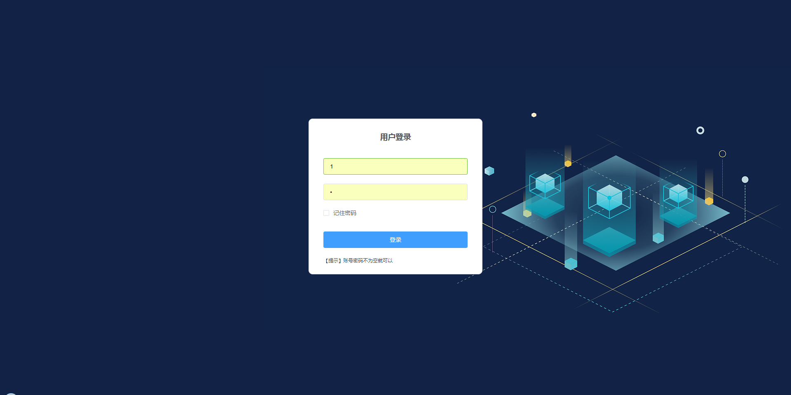
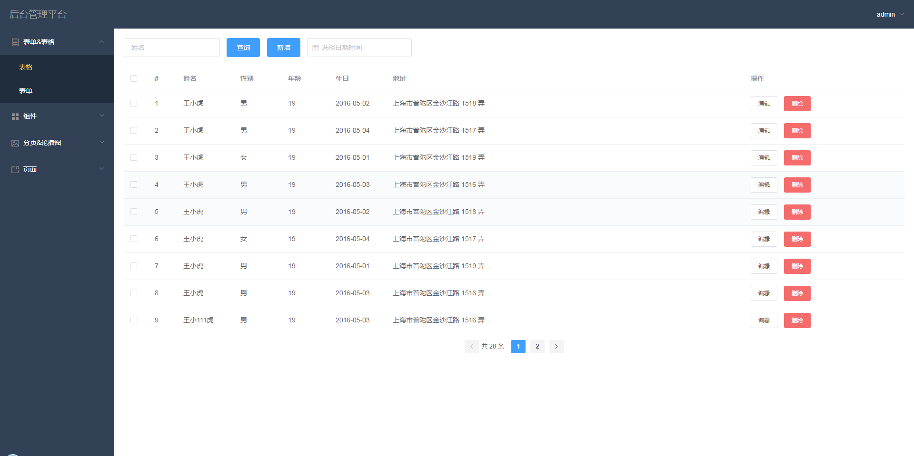
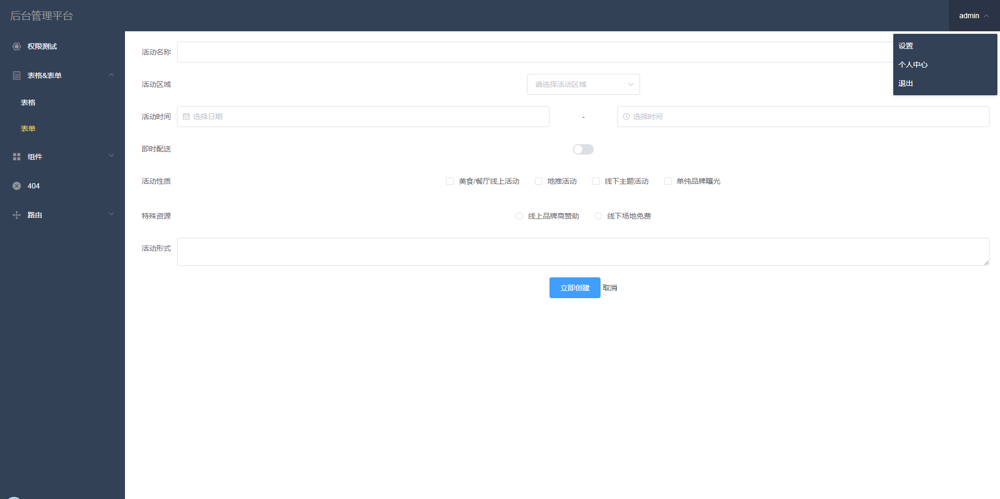
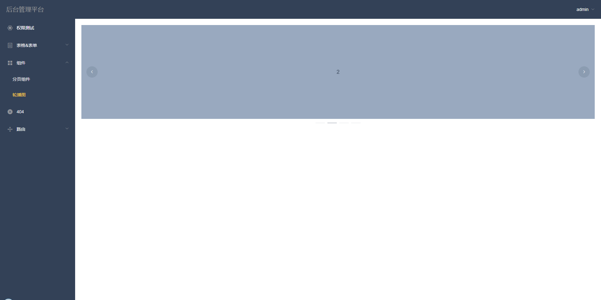

vue搭建后台管理界面模版（PC端）
------------------------

页面模板还在增加中...

  

目录结构
------------------------

```bash
├── /build/          # 项目构建(webpack)相关配置
├── /config/         # 项目开发环境配置
├── /src/            # 源码目录
│ ├── /api/          # 请求
│ ├── /assets/       # 组件静态资源(图片)
│ ├── /components/   # 公共组件
| ├── /api/          # 请求接口
│ ├── /router/       # 路由配置
│ ├── /vuex/         # vuex状态管理
│ ├── /views/        # 路由组件(页面维度)
│ ├── /config/       # 接口配置文件（请求地址）
│ ├── App.vue        # 组件入口
│ └── main.js        # 程序入口
├── /static/         # 非组件静态资源
├── .babelrc         # ES6语法编译配置
├── .editorconfig    # 定义代码格式
├── .eslintignore    # ES6规范忽略文件
├── .eslintrc.js     # ES6语法规范配置
├── .gitignore       # git忽略文件
├── index.html       # 页面入口
├── package.json     # 项目依赖
└── README.md        # 项目文档
```

部分页面组件演示
------------------------

表格组件


form表单组件


轮播图



运行项目
------------------------

``` bash
# install dependencies
npm install

# serve with hot reload at localhost:8080
npm run dev

# build for production with minification
npm run build

# build for production and view the bundle analyzer report
npm run build --report

# run unit tests
npm run unit

# run e2e tests
npm run e2e

# run all tests
npm test


```

项目源码地址：
------------------------

码云地址：https://gitee.com/ldhblog/vue-element.git


